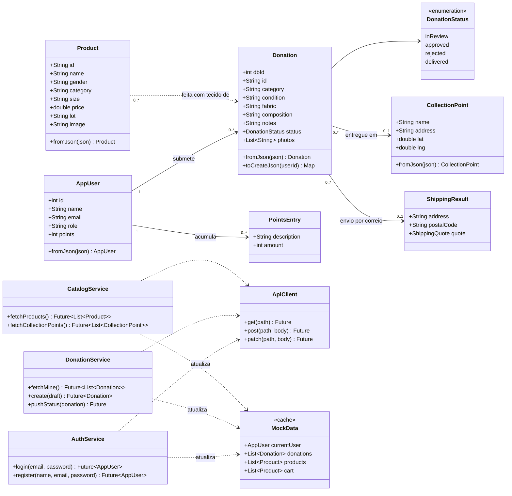

# Diagrama de classes (esboço) — app Flutter

Modelos (entidades) e camada de serviços (MVC: modelos ↔ serviços ↔ ecrãs).

```mermaid
classDiagram
  direction LR
  class AppUser {
    +int id
    +String name
    +String email
    +String role
    +int points
    +fromJson(json) AppUser
  }
  class Donation {
    +int dbId
    +String id
    +String category
    +String condition
    +String fabric
    +String composition
    +String notes
    +DonationStatus status
    +List~String~ photos
    +fromJson(json) Donation
    +toCreateJson(userId) Map
  }
  class DonationStatus {
    <<enumeration>>
    inReview
    approved
    rejected
    delivered
  }
  class Product {
    +String id
    +String name
    +String gender
    +String category
    +String size
    +double price
    +String lot
    +String image
    +fromJson(json) Product
  }
  class CollectionPoint {
    +String name
    +String address
    +double lat
    +double lng
    +fromJson(json) CollectionPoint
  }
  class ShippingResult {
    +String address
    +String postalCode
    +ShippingQuote quote
  }
  class PointsEntry {
    +String description
    +int amount
  }
  class ApiClient {
    +get(path) Future
    +post(path, body) Future
    +patch(path, body) Future
  }
  class AuthService {
    +login(email, password) Future~AppUser~
    +register(name, email, password) Future~AppUser~
  }
  class DonationService {
    +fetchMine() Future~List~Donation~~
    +create(draft) Future~Donation~
    +pushStatus(donation) Future
  }
  class CatalogService {
    +fetchProducts() Future~List~Product~~
    +fetchCollectionPoints() Future~List~CollectionPoint~~
  }
  class MockData {
    <<cache>>
    +AppUser currentUser
    +List~Donation~ donations
    +List~Product~ products
    +List~Product~ cart
  }

  AppUser "1" --> "0..*" Donation : submete
  AppUser "1" --> "0..*" PointsEntry : acumula
  Donation --> DonationStatus
  Donation "0..*" --> "0..1" CollectionPoint : entregue em
  Donation "0..*" --> "0..1" ShippingResult : envio por correio
  Product "0..*" ..> Donation : feita com tecido de
  AuthService ..> ApiClient
  DonationService ..> ApiClient
  CatalogService ..> ApiClient
  AuthService ..> MockData : atualiza
  DonationService ..> MockData : atualiza
  CatalogService ..> MockData : atualiza
```

Imagem: [diagrama_classes.png](diagrama_classes.png)
